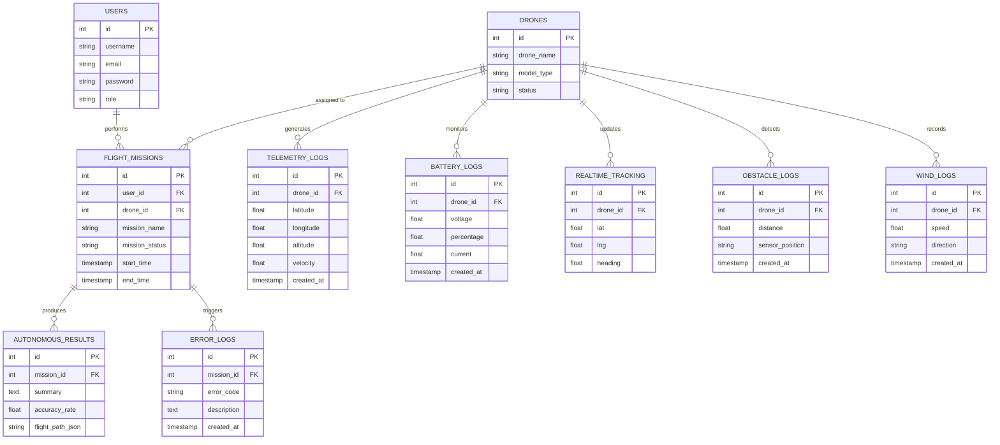
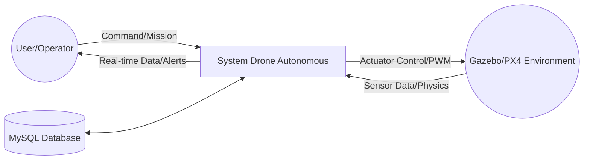
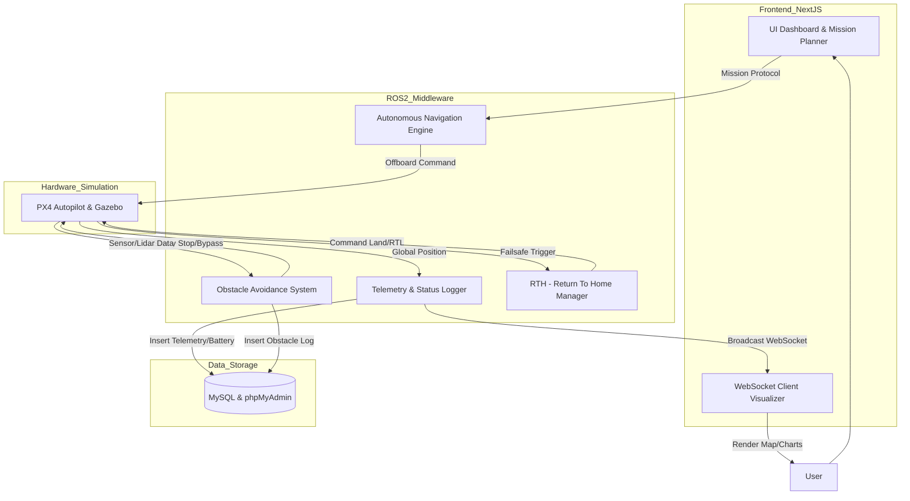

# Dokumentasi Sistem Drone Autonomous
**Platform: ROS 2 Jazzy | PX4 Autopilot | Gazebo Harmonic | Next.js | MySQL**

## 1. Arsitektur Teknologi
Sistem ini dirancang untuk melakukan navigasi drone secara otonom dengan monitoring real-time.
- **Frontend:** Next.js (Dashboard & Visualisasi Map)
- **Communication:** WebSockets (Real-time Data) & REST API
- **Middleware:** ROS 2 Jazzy (DDS Communication)
- **Flight Controller:** PX4 Autopilot
- **Simulator:** Gazebo Harmonic (Physics Engine)
- **Database:** MySQL (dengan phpMyAdmin sebagai manajemen UI)

---

## 2. Entity Relationship Diagram (ERD)
Diagram di bawah ini menjelaskan struktur data dan hubungan antar entitas dalam database MySQL.

---

## 3. Skema Relasi Database
| Tabel | Relasi | Deskripsi |
| :--- | :--- | :--- |
| **Users -> Flight Missions** | `One-to-Many` | Satu user dapat mengelola banyak misi penerbangan. |
| **Drones -> Telemetry/Battery** | `One-to-Many` | Satu drone menghasilkan log telemetri dan baterai secara kontinu. |
| **Drones -> Realtime Tracking** | `One-to-One/Many` | Data posisi terkini drone untuk sinkronisasi dashboard UI. |
| **Flight Missions -> Results** | `One-to-One` | Setiap misi yang selesai akan menghasilkan satu ringkasan hasil otonom. |
| **Drones -> Obstacle/Wind Logs** | `One-to-Many` | Drone mencatat gangguan eksternal (angin/rintangan) selama penerbangan. |

---

## 4. Data Flow Diagram (DFD)

### DFD Level 0 (Context Diagram)
Menggambarkan interaksi sistem utama dengan entitas eksternal (User dan Environment Simulator).

### DFD Level 1 (Process Detail)
Penjelasan detail proses internal sistem.

---

## 5. Penjelasan Proses Utama

1.  **Autonomous Navigation:** Proses ini menerima *waypoints* dari Next.js melalui ROS 2 Service/Action. Navigation Engine menghitung lintasan dan mengirimkan perintah `setpoint_raw` ke PX4.
2.  **Obstacle Avoidance:** Menggunakan data sensor (LiDAR/Depth Camera) dari Gazebo Harmonic. Jika rintangan terdeteksi, sistem interupsi pada DFD Level 1 akan mengalihkan jalur atau menghentikan drone.
3.  **Telemetry Logging:** ROS 2 *subscriber* menangkap data dari topic `/fmu/out/vehicle_global_position` dan menyimpannya ke MySQL melalui backend API secara periodik.
4.  **Battery Monitoring & RTH:** Sistem secara konstan memonitor tegangan baterai. Jika di bawah ambang batas (misal 20%), proses *Return To Home* (P6) akan mengambil alih kendali PX4 untuk mendaratkan drone di *home position*.
5.  **WebSocket Communication:** Digunakan untuk mem-bypass latensi database saat visualisasi. Data koordinat langsung dikirim dari ROS 2 ke UI Next.js untuk pergerakan marker map yang mulus.
6.  **Wind Logging:** Mencatat simulasi gaya eksternal dari Gazebo untuk menganalisis stabilitas algoritma PID/EKF pada drone.

---

## 6. Cara Menggunakan
1.  **Diagram:** Pastikan file ini disimpan dengan ekstensi `.md`. Jika dibuka di GitHub atau VS Code (dengan ekstensi Mermaid), diagram akan otomatis muncul.
2.  **Database:** Gunakan skema ERD untuk membuat tabel di **phpMyAdmin**.
3.  **Integrasi:** Pastikan `rosbridge_suite` terpasang jika ingin menghubungkan Next.js langsung ke ROS 2 melalui WebSockets.

---

### Catatan Profesional
Dokumentasi ini dirancang agar memenuhi standar teknis laporan skripsi atau dokumentasi teknis perusahaan. Penggunaan **Mermaid.js** memastikan bahwa dokumentasi Anda bersifat *version-control friendly* karena berbasis teks, bukan gambar statis.
