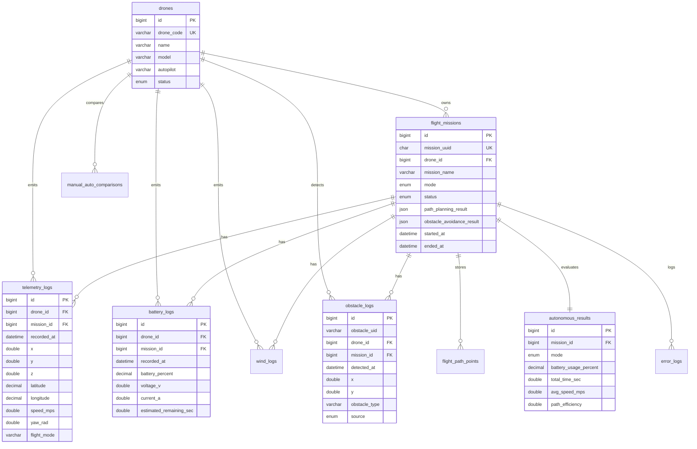

# Integrasi Database Drone ROS 2, PX4, Gazebo, Next.js, MySQL

Dokumen ini mendesain backend database yang ringan, stabil, dan realistis untuk dashboard drone autonomous. Prinsip utamanya: telemetry realtime tidak boleh bergantung pada database untuk kontrol penerbangan. Database dipakai untuk histori, analytics, audit, replay, dan laporan.

## 1. Arsitektur

```text
Gazebo Harmonic / PX4 SITL
        |
        | PX4 topics
        v
ROS 2 Jazzy nodes
        |                         Next.js UI
        | ROS topics              | fetch history/analytics
        v                         v
ROSBridge WebSocket  <---->  Browser dashboard
        |
        | realtime UI stream
        |
ROS 2 MySQL logger
        |
        | batch insert, reconnect
        v
MySQL database  <---->  phpMyAdmin
        ^
        | SQL read/write API
        |
Next.js API routes
```

Alur data:

1. ROS2/PX4/Gazebo mem-publish telemetry ke topic ROS2.
2. Browser Next.js membaca telemetry realtime dari ROSBridge WebSocket untuk tampilan live.
3. Node `mysql_telemetry_logger` subscribe topic ROS2 dan menulis batch ke MySQL.
4. API route Next.js membaca histori dan analytics dari MySQL untuk chart, replay, mission history, dan laporan.
5. phpMyAdmin digunakan untuk administrasi database, inspeksi tabel, backup, dan maintenance.

Kenapa telemetry tidak dikirim dari browser ke database: browser bisa disconnect, throttle, atau ditutup. Logger database harus berjalan dekat ROS2 supaya pencatatan tetap terjadi walaupun UI mati.

## 2. Pilihan Teknologi

Rekomendasi paling ringan untuk project ini:

| Kebutuhan | Pilihan |
| --- | --- |
| Realtime dashboard | ROSBridge WebSocket yang sudah dipakai |
| Penyimpanan telemetry | ROS2 Python logger langsung ke MySQL |
| API histori/analytics UI | Next.js API routes |
| Panel database | phpMyAdmin |
| Cache opsional | Redis hanya jika traffic dashboard banyak |

Jika harus memilih backend terpisah dari daftar Express.js, FastAPI, Flask, NestJS:

| Backend | Cocok untuk | Catatan |
| --- | --- | --- |
| FastAPI | ROS2 integration, async API, WebSocket, Python ecosystem | Pilihan terbaik jika ingin backend terpisah |
| Express.js | API ringan untuk Next.js | Bagus, tetapi ROS2 Python tetap perlu bridge |
| Flask | API sederhana | Kurang ideal untuk realtime dibanding FastAPI |
| NestJS | Backend enterprise besar | Lebih berat dan setup lebih panjang |

Keputusan praktis: gunakan Next.js API routes untuk UI/database, dan ROS2 Python logger untuk ingestion. Tambahkan FastAPI hanya jika nanti butuh service backend mandiri untuk multi-drone/multi-client.

## 3. Data yang Disimpan

Wajib realtime:

| Data | Sumber | Media realtime |
| --- | --- | --- |
| posisi x/y/z, altitude, heading, flight mode | `/odom`, `/dashboard/state` | ROSBridge WebSocket |
| battery percent/voltage/current | `/fmu/out/battery_status`, `/dashboard/state` | ROSBridge WebSocket |
| wind speed/safety | `/fmu/out/wind`, `/dashboard/state` | ROSBridge WebSocket |
| obstacle terdekat dan sensor scan ringkas | `/dashboard/sensor_scan`, `/dashboard/obstacles` | ROSBridge WebSocket |
| mission metrics live | `/dashboard/metrics` | ROSBridge WebSocket |

Wajib disimpan permanen:

| Data | Tabel |
| --- | --- |
| identitas drone | `drones` |
| metadata mission | `flight_missions` |
| telemetry sampling | `telemetry_logs` |
| battery sampling | `battery_logs` |
| planned/actual path penting | `flight_path_points` |
| obstacle detection event | `obstacle_logs` |
| wind sampling/safety event | `wind_logs` |
| error/failsafe/RTH | `error_logs` |
| hasil evaluasi autonomous/manual | `autonomous_results`, `manual_auto_comparisons` |

Cukup cache sementara:

| Data | Saran |
| --- | --- |
| sensor scan LiDAR mentah frekuensi tinggi | Redis/in-memory, jangan simpan semua range ke MySQL |
| posisi live untuk UI | state React/ROSBridge |
| latest telemetry per drone | Redis opsional atau view `latest_drone_telemetry` |
| websocket connection state | in-memory/log event penting saja |

## 4. ERD



Normalisasi sederhana:

1. `drones` menjadi master entitas drone.
2. `flight_missions` menyimpan satu baris per misi.
3. Telemetry, battery, wind, obstacle, dan error dipisah supaya query analytics cepat dan tabel tidak terlalu lebar.
4. `mission_id` boleh `NULL` untuk data saat drone belum berada dalam misi.
5. Payload fleksibel seperti raw ROS message disimpan di kolom `JSON`, tetapi field yang sering dicari tetap dibuat kolom biasa dan diberi index.

## 5. Realtime, REST API, WebSocket, Redis

REST API cocok untuk:

- create/list mission
- ambil histori telemetry
- ambil statistik baterai
- ambil analytics manual vs auto
- simpan event operator

WebSocket/SSE cocok untuk:

- realtime telemetry
- realtime battery chart
- obstacle event live
- mission status live

Di project ini WebSocket sudah ada lewat ROSBridge, jadi jangan menggandakan realtime telemetry lewat database. Gunakan database stream/SSE hanya untuk halaman admin yang ingin melihat data yang benar-benar sudah tersimpan.

Redis tidak wajib untuk satu drone dan satu dashboard. Tambahkan Redis jika:

- dashboard dibuka banyak client
- perlu cache latest state multi-drone
- API analytics mulai berat
- ingin pub/sub backend tanpa langsung membaca MySQL berulang-ulang

## 6. Setup MySQL dan phpMyAdmin

1. Buat database dan tabel:

```bash
mysql -u root -p < /home/iqball/project/database/drone_schema.sql
```

2. Buat user aplikasi:

```sql
CREATE USER 'drone_app'@'%' IDENTIFIED BY 'change-this-password';
GRANT SELECT, INSERT, UPDATE, DELETE ON drone_ops.* TO 'drone_app'@'%';
FLUSH PRIVILEGES;
```

3. Login phpMyAdmin dengan user admin/root untuk inspeksi, backup, dan maintenance. Aplikasi jangan memakai user root.

## 7. Environment Variables

Frontend Next.js:

```env
DB_HOST=127.0.0.1
DB_PORT=3306
DB_USER=drone_app
DB_PASSWORD=change-this-password
DB_NAME=drone_ops
API_WRITE_KEY=change-this-api-key
```

ROS2 logger:

```bash
export DRONE_DB_HOST=127.0.0.1
export DRONE_DB_PORT=3306
export DRONE_DB_USER=drone_app
export DRONE_DB_PASSWORD=change-this-password
export DRONE_DB_NAME=drone_ops
export DRONE_DB_DRONE_ID=1
```

Install dependency runtime di Ubuntu/WSL:

```bash
sudo apt update
sudo apt install -y mysql-server mysql-client python3-pymysql
```

Jika kamu juga ingin phpMyAdmin di mesin yang sama:

```bash
sudo apt install -y phpmyadmin
```

Aktifkan MySQL dan buat schema:

```bash
sudo service mysql start
sudo mysql < /home/iqball/project/database/drone_schema.sql
```

Jalankan logger ROS2:

```bash
cd /home/iqball/project/ros2_ws
colcon build --symlink-install --packages-select drone_dashboard_bridge
source install/setup.bash
ros2 launch drone_dashboard_bridge mysql_telemetry_logger.launch.py
```

Jalankan frontend setelah `.env.local` dibuat dari `.env.example`:

```bash
cd /home/iqball/project/frontend
npm install
npm run dev
```

## 8. Optimasi Database

Rekomendasi untuk telemetry besar:

1. Simpan telemetry 2 sampai 10 Hz untuk histori. Jangan simpan 50 sampai 100 Hz kecuali sedang debugging.
2. Batch insert 50 sampai 300 baris per flush.
3. Gunakan index `(drone_id, recorded_at)` dan `(mission_id, recorded_at)`.
4. Query histori selalu pakai filter waktu atau mission.
5. Simpan LiDAR mentah di file/object storage jika perlu, bukan tabel MySQL row-per-range.
6. Archive telemetry lama ke tabel bulanan atau file Parquet/CSV.
7. Buat downsample table jika dashboard sering membuka rentang waktu panjang, misalnya rata-rata per 1 detik atau 10 detik.
8. Untuk produksi besar, gunakan partition per bulan pada tabel `telemetry_logs`, `battery_logs`, dan `wind_logs`.

Contoh partition opsional:

```sql
ALTER TABLE telemetry_logs
PARTITION BY RANGE COLUMNS(recorded_at) (
  PARTITION p202605 VALUES LESS THAN ('2026-06-01'),
  PARTITION p202606 VALUES LESS THAN ('2026-07-01'),
  PARTITION pmax VALUES LESS THAN (MAXVALUE)
);
```

Catatan: partition butuh desain primary/index yang cocok di MySQL. Terapkan setelah data mulai besar.

## 9. Keamanan

1. Pakai user database khusus aplikasi, bukan root.
2. Simpan credential di `.env.local` dan environment ROS2, jangan commit password.
3. Gunakan parameterized query, jangan string SQL gabungan dari input user.
4. Batasi API POST/DELETE dengan session/JWT/API key.
5. Pisahkan role:
   - `admin`: manage database, user, backup
   - `operator`: start/stop mission, lihat dashboard
   - `viewer`: read-only analytics
6. phpMyAdmin jangan dibuka publik tanpa VPN/reverse proxy auth.
7. Log event penting: websocket disconnect, rosbridge error, battery failsafe, obstacle detection failure, RTH trigger.

## 10. Best Practice Penyimpanan Telemetry

Desain yang disarankan:

- Realtime UI: ROSBridge langsung.
- Durable log: ROS2 logger batch ke MySQL.
- Latest state: view/cache.
- Analytics: query agregasi dari tabel histori.
- Replay: pakai `telemetry_logs` dan `flight_path_points`.
- Debug raw: simpan payload JSON hanya secukupnya, bukan semua data sensor frekuensi tinggi.

Target awal yang ringan:

- telemetry: 5 Hz
- battery: 1 Hz
- wind: 1 Hz
- obstacle event: event-based
- error log: event-based
- metrics mission: 1 Hz atau saat mission selesai
