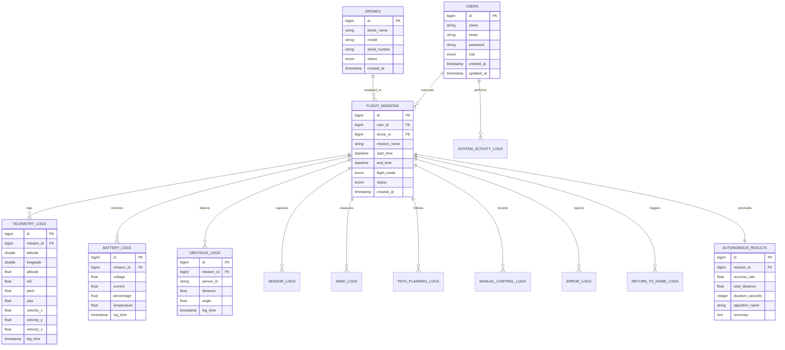

# Dokumentasi Skema Relasi Database: Autonomous Drone System

Sistem ini menggunakan arsitektur relasional untuk mengelola data operasional drone, misi penerbangan, dan log telemetri real-time yang dihasilkan oleh integrasi ROS 2 Jazzy, PX4 Autopilot, dan Gazebo Harmonic.

## 1. ER Diagram (Mermaid.js)

Berikut adalah visualisasi hubungan antar tabel menggunakan Mermaid.js.

---

## 2. Detail Spesifikasi Tabel

### A. Tabel Core (Master Data)

| Nama Tabel | Atribut (Kolom) | Tipe Data | Constraint | Deskripsi |
| :--- | :--- | :--- | :--- | :--- |
| **users** | id, name, email, password, role, created_at, updated_at | BIGINT, VARCHAR, ENUM | PK, Unique (email) | Data pengguna/pilot dashboard. |
| **drones** | id, drone_name, model, serial_number, status, created_at | BIGINT, VARCHAR, ENUM | PK, Unique (SN) | Inventaris unit drone PX4. |
| **flight_missions** | id, user_id, drone_id, mission_name, start_time, end_time, flight_mode, status | BIGINT, DATETIME, ENUM | PK, FK_users, FK_drones | Header data sesi penerbangan. |

### B. Tabel Telemetri & Sensor (High-Volume Data)

| Nama Tabel | Atribut Utama | Tipe Data | Relasi | Deskripsi |
| :--- | :--- | :--- | :--- | :--- |
| **telemetry_logs** | latitude, longitude, altitude, roll, pitch, yaw, velocity | DOUBLE, FLOAT | FK (mission_id) | Log posisi dan orientasi dari PX4. |
| **battery_logs** | voltage, current, percentage, temperature | FLOAT | FK (mission_id) | Monitoring status daya real-time. |
| **obstacle_logs** | sensor_id, distance, angle | FLOAT, VARCHAR | FK (mission_id) | Data deteksi dari sensor LiDAR/Ultrasonic. |
| **sensor_logs** | sensor_type, raw_data, status | VARCHAR, JSON | FK (mission_id) | Data mentah sensor lainnya (IMU, Mag, dll). |
| **wind_logs** | wind_speed, direction | FLOAT | FK (mission_id) | Estimasi kondisi angin saat terbang. |

### C. Tabel Navigasi & Kontrol

| Nama Tabel | Atribut Utama | Tipe Data | Relasi | Deskripsi |
| :--- | :--- | :--- | :--- | :--- |
| **path_planning_logs** | waypoint_lat, waypoint_lon, alt, sequence | DOUBLE, INT | FK (mission_id) | Log rute yang direncanakan vs aktual. |
| **manual_control_logs** | input_source, throttle, roll, pitch, yaw | VARCHAR, FLOAT | FK (mission_id) | Rekaman input jika pilot mengambil alih. |
| **return_to_home_logs** | trigger_reason, home_lat, home_lon, land_time | TEXT, DOUBLE | FK (mission_id) | Log prosedur emergency/RTH. |

### D. Tabel Analitik & Sistem

| Nama Tabel | Atribut Utama | Tipe Data | Relasi | Deskripsi |
| :--- | :--- | :--- | :--- | :--- |
| **autonomous_results** | success_rate, duration, algorithm_used | FLOAT, TEXT | FK (mission_id) | Hasil akhir analisis misi (1:1 per misi). |
| **error_logs** | error_code, message, severity | VARCHAR, ENUM | FK (mission_id) | Log malfungsi hardware/software (ROS 2). |
| **system_activity_logs**| user_id, action, description, ip_address | BIGINT, TEXT | FK (user_id) | Audit trail aktivitas user di dashboard. |

---

## 3. Penjelasan Hubungan (Relationships)

1.  **One-to-Many (1:N):**
    *   **User -> Mission:** Satu pilot dapat mengeksekusi banyak misi penerbangan.
    *   **Drone -> Mission:** Satu drone dapat digunakan untuk berbagai misi di waktu yang berbeda.
    *   **Mission -> Logs (Telemetry, Battery, etc):** Satu sesi misi menghasilkan ribuan baris data log. Ini memungkinkan tracking performa per detik melalui dashboard Next.js.
2.  **One-to-One (1:1):**
    *   **Mission -> Autonomous Results:** Setiap misi yang selesai akan diproses untuk menghasilkan satu laporan kesimpulan performa otonom.
3.  **Many-to-Many (M:N):**
    *   Dalam skema ini, relasi M:N antara User dan Drone dijembatani oleh tabel `flight_missions` (sehingga menjadi dua relasi 1:N) untuk menjaga normalisasi 3NF.

---

## 4. Tips Implementasi untuk Dashboard Next.js & ROS 2

*   **Indexing:** Pastikan kolom `mission_id` dan `log_time` pada tabel log diberikan **Index** untuk mempercepat query grafik real-time di Next.js.
*   **Data Partitioning:** Karena tabel `telemetry_logs` akan tumbuh sangat cepat (high frequency), pertimbangkan menggunakan teknik *table partitioning* berdasarkan bulan atau `mission_id` di MySQL.
*   **Bridge Connection:** Gunakan Python script (dengan `mysql-connector-python`) di sisi ROS 2 yang melakukan *subscribe* ke topik `/fmu/out/vehicle_gps_position` dan `/fmu/out/battery_status`, lalu melakukan `INSERT` ke database ini.
*   **JSON Support:** Tabel `sensor_logs` menggunakan tipe data **JSON** agar fleksibel jika Anda menambahkan sensor baru tanpa harus mengubah struktur tabel.
