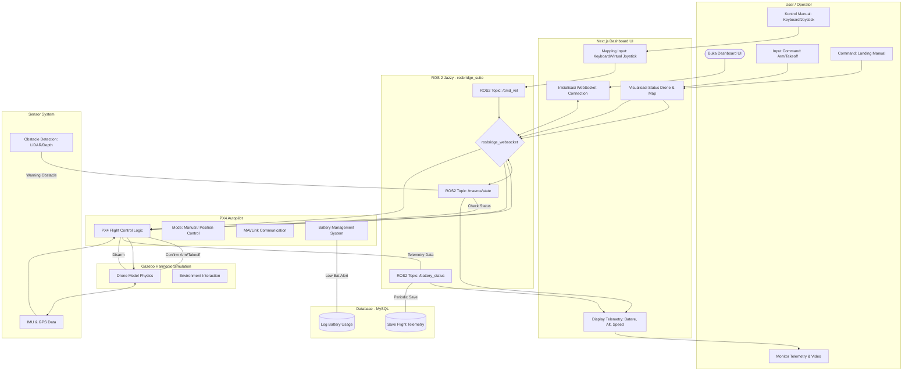

# Dokumentasi Sistem Drone: Flowmap Manual & Autonomous

Dokumentasi ini menjelaskan alur kerja sistem drone berbasis **ROS 2 Jazzy**, **PX4 Autopilot**, dan **Next.js Dashboard**. Arsitektur ini menggunakan **rosbridge_suite** untuk komunikasi antara Web UI dan ROS2, serta **Gazebo Harmonic** sebagai lingkungan simulasi.

---

## 1. Flowmap Sistem Kontrol Drone Manual
Flowmap ini menggambarkan interaksi real-time di mana user memegang kendali penuh atas pergerakan drone melalui dashboard.



---

## 2. Flowmap Sistem Drone Autonomous (Mission Mode)
Flowmap ini menggambarkan alur cerdas drone mulai dari perencanaan jalur, deteksi rintangan otomatis, hingga protokol keamanan (*fail-safe*).

```mermaid
flowchart TD
    %% Subgraph Definitions
    subgraph User_Actor [User / Operator]
        A1([Buka Dashboard UI])
        A2[Tentukan Titik Waypoint di Map]
        A3[Klik: Start Autonomous Mission]
        A4[Monitoring Progress Mission]
    end

    subgraph Frontend [Next.js Dashboard UI]
        B1[Map Interface & Waypoint Selection]
        B2[Visualisasi Path Planning]
        B3[Alert System: Obstacle/Weather]
    end

    subgraph ROS2_Logic [ROS 2 Jazzy Node]
        R1[Global Path Planner]
        R2[Local Planner: Obstacle Avoidance]
        R3[Mission Coordinator]
        R4[Wind & Battery Monitor Node]
    end

    subgraph Flight_Stack [PX4 Autopilot]
        PX1[Navigation Controller]
        PX2[Auto Mission Mode]
        PX3[Fail-safe: Return To Home - RTH]
        PX4[Auto Landing System]
    end

    subgraph Physics_Sim [Gazebo Harmonic]
        GZ1[Drone Movement in Simulation]
        GZ2[Dynamic Obstacle Modeling]
    end

    subgraph Sensing [Sensor System]
        SN1[LiDAR/Depth Camera Scan]
        SN2[Positioning System: RTK/GPS]
        SN3[Anemometer: Wind Speed Sim]
    end

    subgraph Storage [Database - MySQL]
        DB1[(Mission Logs: Waypoints)]
        DB2[(Telemetry & Battery Log)]
        DB3[(Final Evaluation Report)]
    end

    %% Connections
    A1 --> B1
    A2 --> B1 --> R1
    R1 -- Calculate Best Route --- R3
    A3 --> B2 --> R3
    
    R3 -- Send Waypoints --- PX2
    PX2 --> GZ1
    
    %% Feedback Loop Autonomous
    GZ1 <--> SN2 --> PX1
    SN1 -- Scan Obstacle --- R2
    
    R2 -- "Rintangan Terdeteksi?" --- C{Ada Halangan?}
    C -- Ya --|Replanning| R1
    C -- Tidak --|Continue| PX2
    
    %% Fail-safe Logic
    SN3 -- Wind Speed --- R4
    PX2 -- Battery Level --- R4
    R4 -- "Battery <= 10% OR Wind > 20kt" --- FS{Fail-safe Triggered?}
    FS -- Ya --> PX3
    PX3 --> PX4
    
    FS -- Tidak --> PX2
    
    %% Post Mission
    PX4 -- Mission Success --- DB1
    PX4 -- Landed --- DB2
    R3 -- Generate Performance Data --- DB3
    DB3 --> B3 --> A4
```
